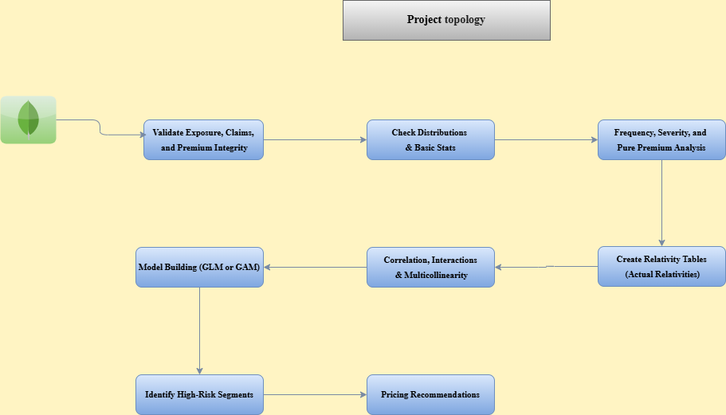

# Auto_Mobile_Inusrance_Analysis


## *Author  [Omar Soub](https://github.com/omars1234)*

## *Overview*

*Still Working On this Project ...*


## How to run ?


```bash
clone https://github.com/omars1234/Auto_Mobile_Inusrance_Analysis.git
```

```bash
conda create -n EnvAuoInsuranceAnalysis python=3.10 -y
```

```bash
conda activate EnvAuoInsuranceAnalysis
```

```bash
pip install -r requirements.txt
```

## Project Structure

### Project Topology




---

### Project Map

*1. Validate Exposure, Claims, and Premium Integrity*

* *Check exposure quality --> No zero/negative exposure*

* *Check claims integrity --> No claim paid above Sum Insured (SI)*

* *No negative claim cost*

*2. Check Distributions & Basic Stats*

* *Numerical Variables*
* *Numerical Variables Visualizations*

* *Categoricalical Variables Visualizations*

*3. Frequency, Severity, and Pure Premium Analysis*

* *Frequency = claims / exposure*

* *Severity = claim cost / claims*

* *Pure premium = frequency × severity*


*4. Create Relativity Tables (Actual Relativities)*

*Create Relativity Table For each categorical feature*

* *Relativity = (segment pure premium) / (overall pure premium)*

*This tells the pricing team which segments are:<br> Riskier (>1)<br> Safer (<1)*


*5. Correlation, Interactions & Multicollinearity*


*6. Model Building (GLM or GAM)*

* *Poisson / Tweedie / Gamma GLM*

* *GAM with smooth terms (vehicle age, vehicle value)*

* *Evaluate --> AIC,Deviance explained,Residual analysis,Calibration*


*7. Identify High-Risk Segments*

*After modelling, extract segments with*

* *High predicted frequency*

* *High predicted severity*

* *High pure premium*

* *Exposure growth with worsening performance*


*8. Pricing Recommendations*


