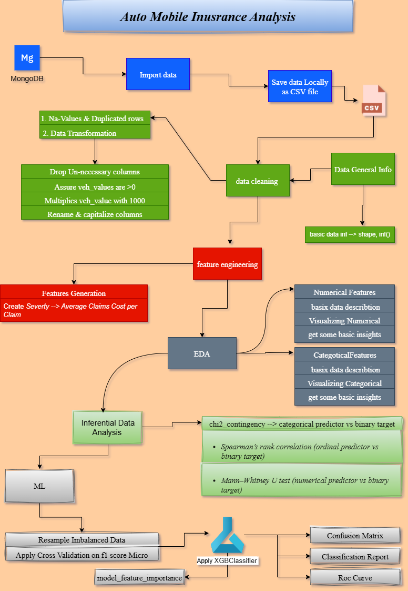

# Auto_Mobile_Inusrance_Analysis


## *Author  [Omar Soub](https://github.com/omars1234)*

## *Overview*

*On this Project ...*


## How to run ?


```bash
clone https://github.com/omars1234/Auto_Mobile_Inusrance_Analysis.git
```

```bash
conda create -n EnvAuoInsuranceAnalysis python=3.10 -y
```

```bash
conda activate EnvAuoInsuranceAnalysis
```

```bash
pip install -r requirements.txt
```

## *Project Structure :*  

*